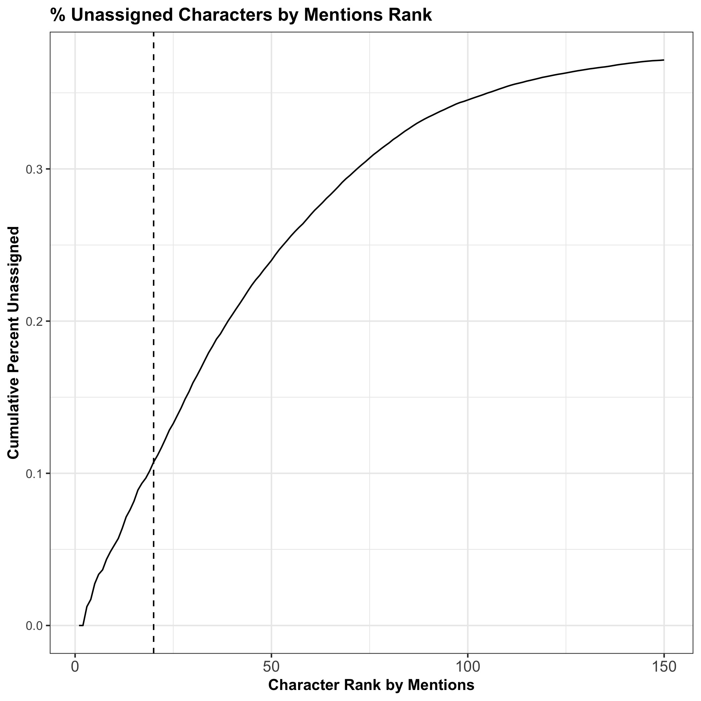
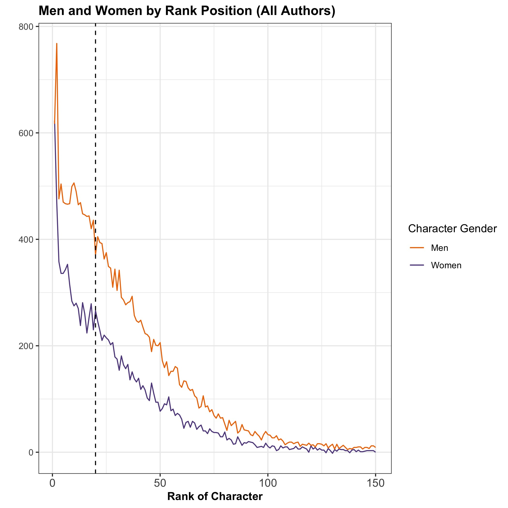
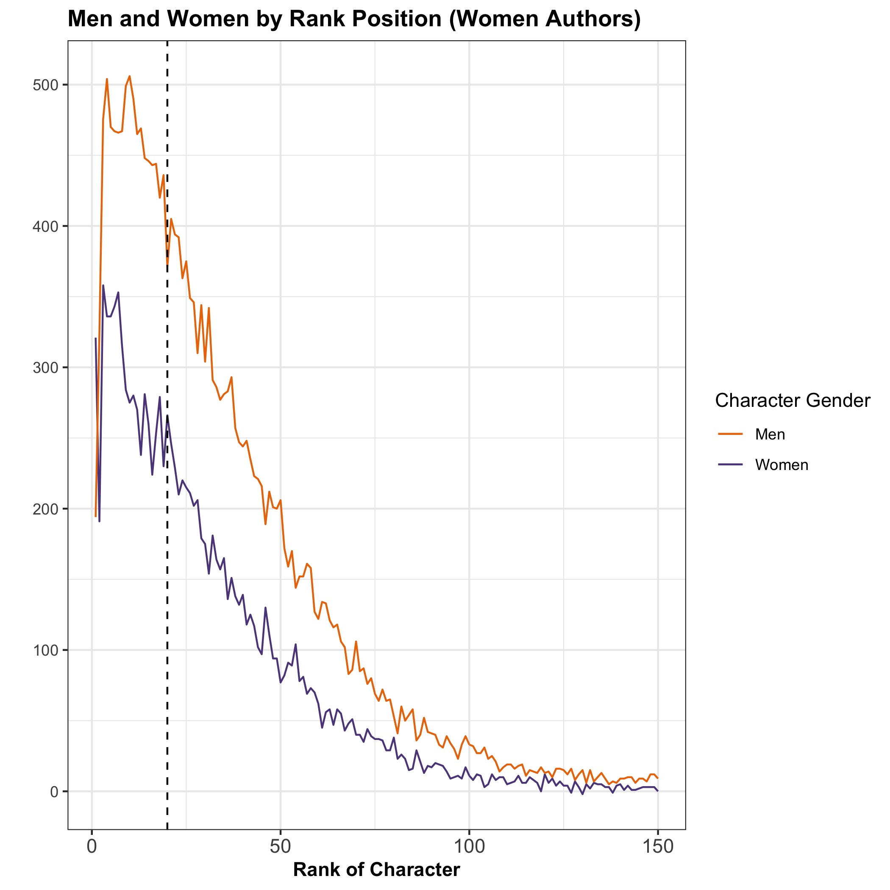
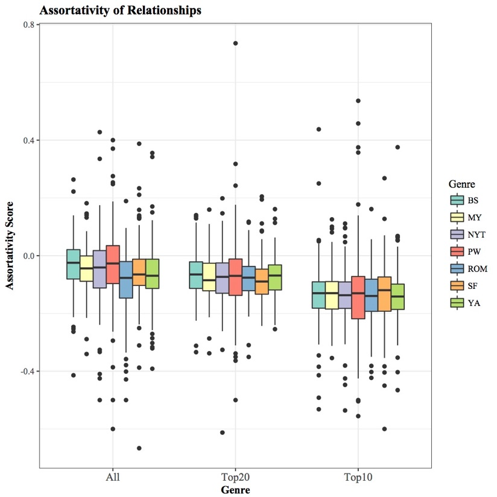
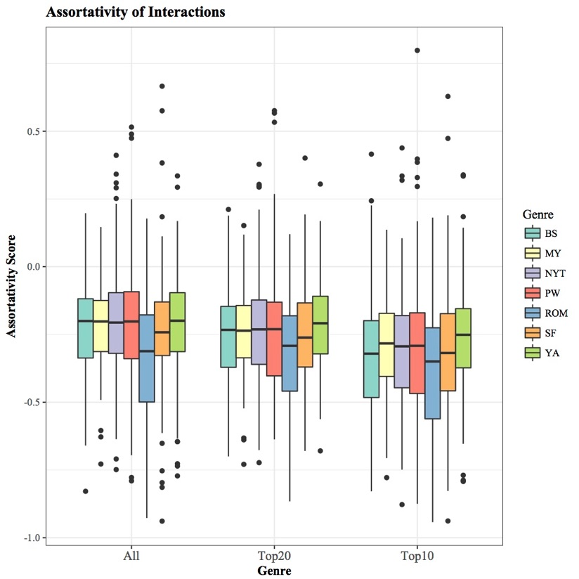
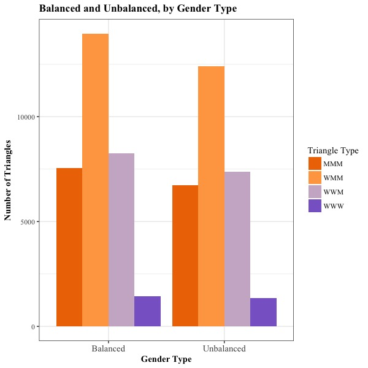

background-image: url(images/Social_Characters.png)
background-size: contain

---
class: left

## Agenda

1. Introduction to data and the digital humanities
2. Methods and findings
3. Impact of author's graphics for their intended audience


```{r setup, include=FALSE}
library(knitr)

options(htmltools.dir.version = FALSE)
opts_chunk$set(echo = FALSE)

```

---

background-image: url(images/CA_image.png)
background-size: contain

---
class: left
## Introduction

- Visibility
- "Connectivity" through character pairs
- Heteronormativity of pairs
- Gender and social balance theory

---
class: left
## The Data

- Over 1,000 novels
- 26,400 characters
- BooksNLP program (Neuro-linguistic Programming)


---
class: center, middle

#### Character prominence declines non-linearly as number of mentions decreases in each novel.

```{r  out.width="500px"}
include_graphics(path = "./figures/figure_1.jpg")
```


---
class: center, middle

#### Number of non-assigned gender characters rises as character mentions increase

```{r out.width="500px"}

```

---
class: center, middle

#### Count bycharacter mentions for all authors

```{r out.width="500px"}

```

---
class: center, middle

#### Count by character mentions for women authors only

```{r out.width="500px"}

```

---
class: center, middle

```{r out.width="600px"}

```

---
class: center, middle

```{r out.width="600px"}

```
---
class: center, middle

```{r out.width="600px"}

```
---
class: center, middle

## Questions?
